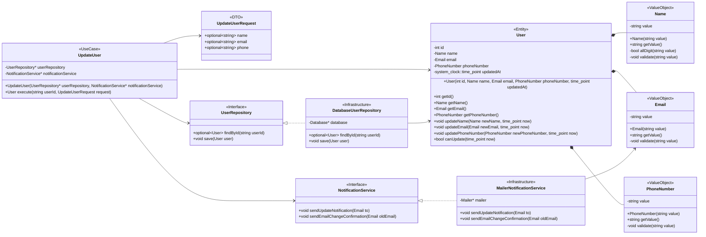
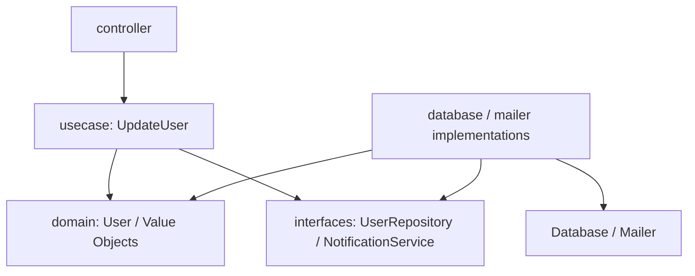

# 詳細クラス図

現在の設計方針では、`User` をドメインの中心に置き、`Name` / `Email` / `PhoneNumber` を Value Object として保持する。
ユースケース層の `UpdateUser` は、DB やメール送信の具体実装には依存せず、`UserRepository` と `NotificationService` のインターフェースに依存する。

## 依存の向き

## 責務の分担

- `Name` / `Email` / `PhoneNumber`: 値そのものの妥当性を守る。
- `User`: ユーザーの状態を持ち、更新日時や30日制限などユーザーに関するルールを扱う。
- `UpdateUser`: ユーザー取得、更新、保存、通知依頼というアプリケーションの手順を扱う。
- `UserRepository`: `UpdateUser` がユーザーを取得・保存するための抽象。
- `NotificationService`: `UpdateUser` が通知を依頼するための抽象。
- `DatabaseUserRepository`: `Database` と `User` の変換を担当する外側の実装。
- `MailerNotificationService`: `Mailer` を使って通知を送る外側の実装。
