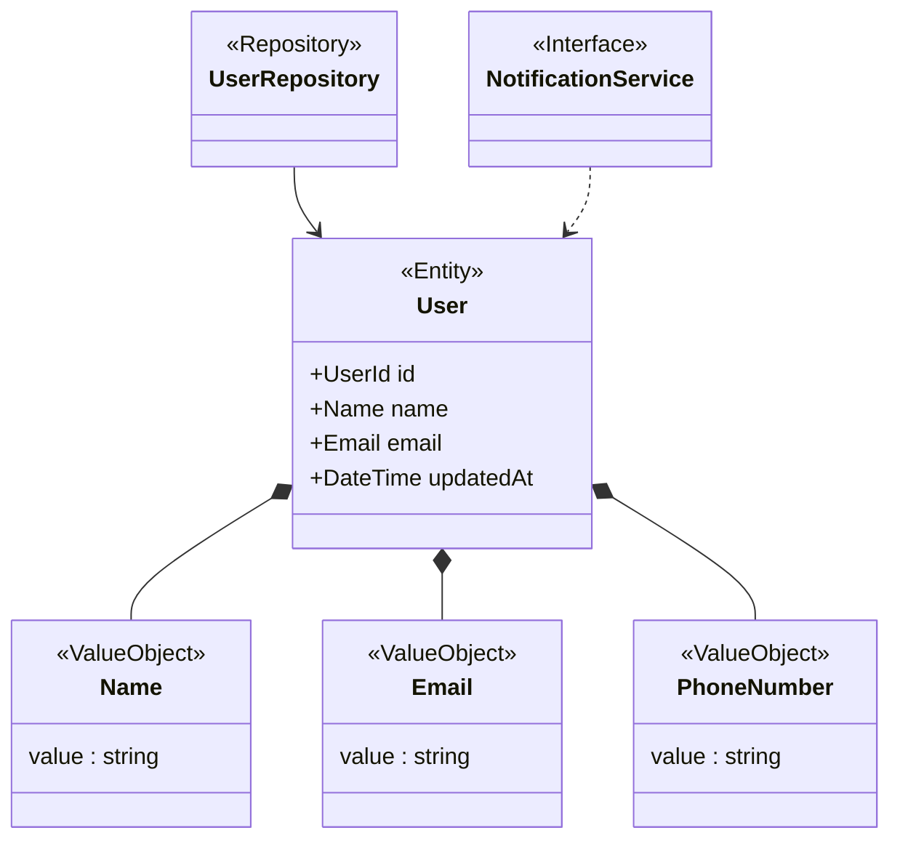

ドメインモデル図

```mermaid
classDiagram

class User{
    <<Entity>>
    +UserId id
    +Name name
    +Email email
    +DateTime updatedAt
}

class Name{
    <<ValueObject>>
    value : string
}

class Email {
    <<ValueObject>>
    value : string
}

class PhoneNumber{
    <<ValueObject>>
    value : string
}

class UserRepository {
        <<Repository>>
}

class NotificationService {
        <<Interface>>
}

User *-- Name
User *-- Email
User *-- PhoneNumber

UserRepository --> User
NotificationService ..> User

```
