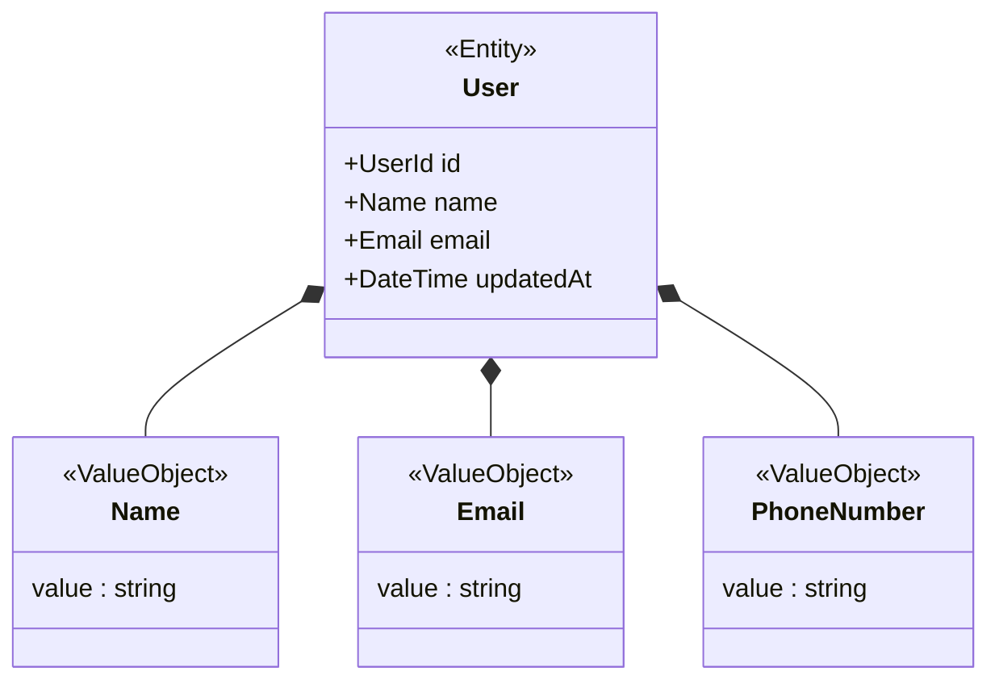

クラス図

```mermaid
classDiagram

class User{
    <<Entity>>
    +UserId id
    +Name name
    +Email email
    +DateTime updatedAt
}

class Name{
    <<ValueObject>>
    value : string
}

class Email {
    <<ValueObject>>
    value : string
}

class PhoneNumber{
    <<ValueObject>>
    value : string
}

User *-- Name
User *-- Email
User *-- PhoneNumber

```
